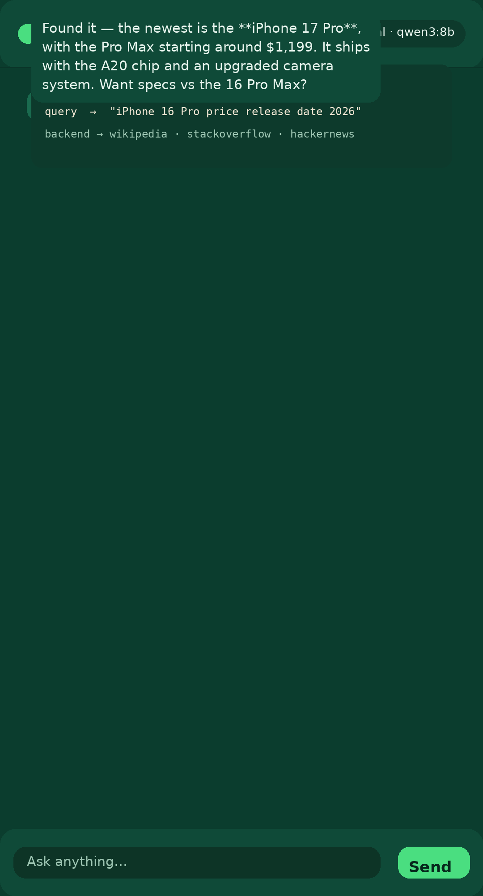
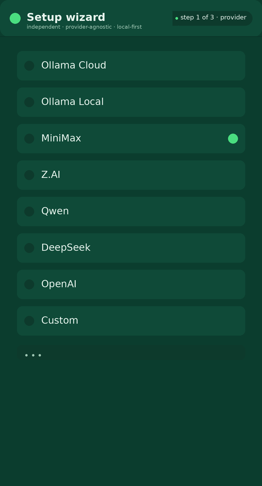
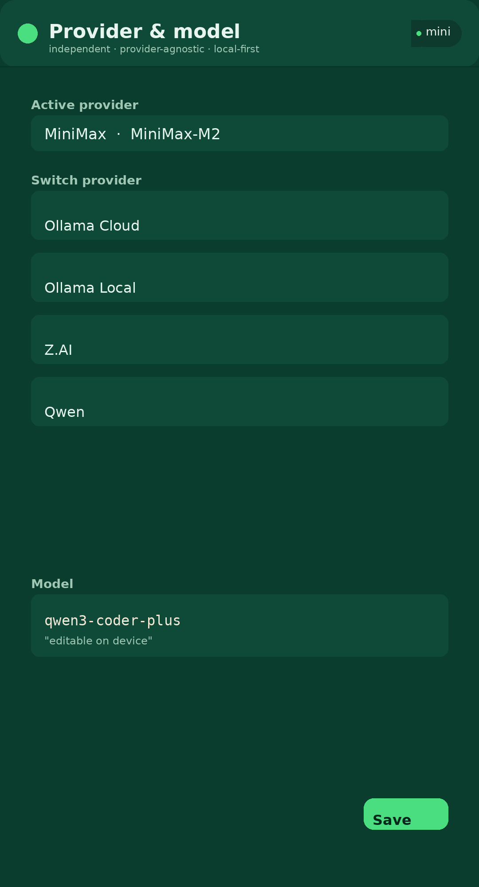

<p align="center">
  
</p>

<h1 align="center">🌲 Open Forest Harness · OFH</h1>
<p align="center"><strong>Your own AI agent, running entirely on your phone — built from scratch, provider-agnostic, zero cloud lock-in.</strong></p>

<p align="center">
  
  
  
  
  
  
</p>

<p align="center">
  
  
  
</p>

---

## 🐐 What is OFH?

**OFH (Open Forest Harness)** is a **fully independent, from-scratch Android agent harness** — not a wrapper, not a rebrand. It has its own **pure-Kotlin agent loop**, its own **OpenAI-compatible provider client**, its own **tool registry**, and its own **WebView chat UI**. It runs **entirely on your phone** and talks to whichever LLM provider you choose.

- 🧠 **A real agent loop** — plan → act → observe → repeat, with streaming replies and tool-call round-trips.
- 🔌 **Provider-agnostic** — one client, many models. Bring your own key, your own base URL.
- 🏠 **Local-first** — works with a local Ollama on your LAN with **zero cloud**.
- ⚡ **Real-time** — live web search & fetch tools for grounded answers.
- 🐐 **A rad cartoon goat** — forest greens, no whales, no third-party branding.
- 🧩 **Extensible** — register new tools, load skills as markdown, swap memory backends.

**OFH is not the DeepSeek wrapper.** That was the earlier, separate OpenForest app. This is the full rewrite: OFH's **own** harness from the ground up.

---

## ✨ Features

| Area | What you get |
|---|---|
| **Agent loop** | Plan → act → observe, streaming responses, `max_iterations` + **120s wall-clock budget** so loops can't hang |
| **Providers** | Ollama Cloud · Ollama **Local** · MiniMax · Z.AI · Qwen · DeepSeek · OpenAI · **Custom** (any OpenAI-compatible base URL) |
| **Real-time grounding** | `web_search` (wikipedia/stackoverflow/hackernews/npm/mdn/archive) + `web_fetch` |
| **Tools** | `device_info`, `memory`, `skills` — plus your own via the registry |
| **Memory** | Long-term notes you can store & recall |
| **Skills** | Load instruction sets from `SKILL.md` |
| **Setup** | First-run provider wizard; persistent provider/model switcher in the chat header |
| **UI** | Dark forest-green WebView chat, tool-call cards, streaming tokens |
| **Config** | Lives in `~/.ofh/` (`settings.yaml` + `.credentials.yaml`) — mirrors the DSH layout |

---

## 🚀 Quickstart

1. **Install the APK** — grab the latest from the [Releases](../../releases) page (or build it yourself, below).
2. **First launch** → the **setup wizard** appears.
3. **Pick a provider**:
   - 🌩️ **Ollama Cloud / MiniMax / Z.AI / Qwen / DeepSeek / OpenAI** → paste your API key.
   - 🏠 **Ollama Local** → no key needed; base URL defaults to `http://127.0.0.1:11434/v1`.
   - 🧩 **Custom** → enter any OpenAI-compatible base URL + model (+ key, optional).
4. **Save** and start chatting.
5. Switch providers/models anytime from the **chat header**.

> Zero-key smoke test: run a local Ollama, pick **Ollama Local**, and ask "what's the newest iPhone and how much?" — it will stream an answer and run a `web_search` tool call.

---

## 🏗️ How it works

```
        ┌─────────────┐      POST /chat/completions (SSE)
        │  WebView UI │ ────────────────────────────────►  ProviderAdapter
        │  (bridge)   │ ◄────────── streaming deltas ───────  (OpenAI-compatible)
        └──────┬──────┘
               │ window.OFH.send / onDelta / onDone / onTool
               ▼
          AgentLoop          plan → LLM → execute → observe → repeat
          │   │  │
          │   │  └──► ToolRegistry ──► web_search · web_fetch · device_info · memory · skills
          │   └──────► run budget (120s) + memory + skills injection
          └──────────► history / messages
```

- **ProviderAdapter** — one HTTP client serves every provider: streaming SSE, tool-call parsing, auth header.
- **AgentLoop** — runs a user turn, executes tool calls, observes results, streams the reply; capped by an iteration count and a wall-clock budget.
- **ToolRegistry** — register / dispatch tools by name with JSON schema; unknown tools return a friendly error.
- **ProviderConfig** — presets + `~/.ofh/` persistence (credentials refs + `agent-default-model`), mirrors the DSH format.

---

## 📦 Building it yourself

Requirements: **Android SDK (compileSdk 35)**, JDK **17**. AGP **8.11.1** + Kotlin **2.2.20**.

```bash
./gradlew :app:assembleRelease          # signed release APK
./gradlew :app:testDebugUnitTest        # 3/3 integration tests pass
```

Output: `app/build/outputs/apk/release/app-release.apk`.

> Signing: set `OFH_KEYSTORE_FILE` / `OFH_KEYSTORE_PASS` (keyAlias `ofh`) or drop a `release.keystore`
> in the project root — a plain build uses it automatically.

---

## 🗂️ Project layout

```
app/src/main/java/com/ofh/harness/
├── ProviderConfig.kt      # provider presets + ~/.ofh/ config
├── ProviderAdapter.kt     # OpenAI-compatible client (streaming + tools)
├── AgentLoop.kt           # plan → act → observe, run budget, persona
├── ToolRegistry.kt        # register / dispatch tools
├── BuiltinTools.kt        # web_search, web_fetch, device_info, memory, skills
├── Memory.kt              # long-term notes
├── Skills.kt              # SKILL.md loader
├── MainActivity.kt        # launcher
├── SetupWizardActivity.kt # first-run provider picker
└── WebViewActivity.kt     # chat UI + JS bridge → AgentLoop
assets/web/index.html      # dark forest-green chat UI
```

---

## 🗺️ Roadmap

- **0.1.0** ✅ provider-agnostic harness skeleton + streaming
- **0.2.0** ✅ wizard, provider switcher, tool-call rendering, 120s budget, memory, skills
- **0.3.0** 🔜 on-device verification pass, summarized search results, tool-output limits
- **1.0.0** personality presets, multimodal, background curator, MCP support

---

## 🔒 Privacy & security

- **Your API key lives on-device** in `~/.ofh/`.credentials.yaml — never baked into the APK, never uploaded anywhere.
- All requests go **directly** to the provider you chose. No middle server.
- Local-first: with Ollama Local, **nothing** leaves your network.

---

## 📄 License

MIT — use it, fork it, teach it. The goat approves. 🐐
